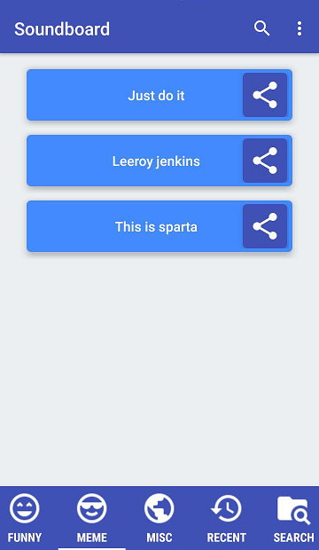
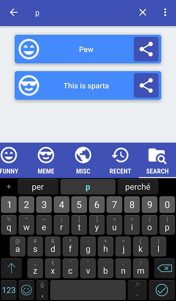

Soundboard Android app with search, categorization, chronology and share functionalities.

Interesting feature developed:
- Search View implemented in the toolbar for a fast search with instant search while typing a query.
- Observer pattern applied to SoundsAdapter to automatically notify the adapter when the underlying data has changed.
- Activity with tabs and fragments to categorize sounds.

To add/remove Categories modify the Enum [Categories](app\src\main\java\com\soundboard\models\Categories.java) and add/remove the icon with the same name in the [res\drawable](app\src\main\res\drawable) folder.
To add/remove sounds place your audio files in the [res\raw](app\src\main\res\raw) folder. The sounds will always be categorized by their name if the first part is matching one of the Category, ignored otherwise.
For example if there is a file in res/raw folder with the name "funny_yelling_at_door.ogg" it will be assigned the "Funny" category and the name "Yelling at door".

Some screenshots:

Developed in 2018 by:
Alessandro De Francesco